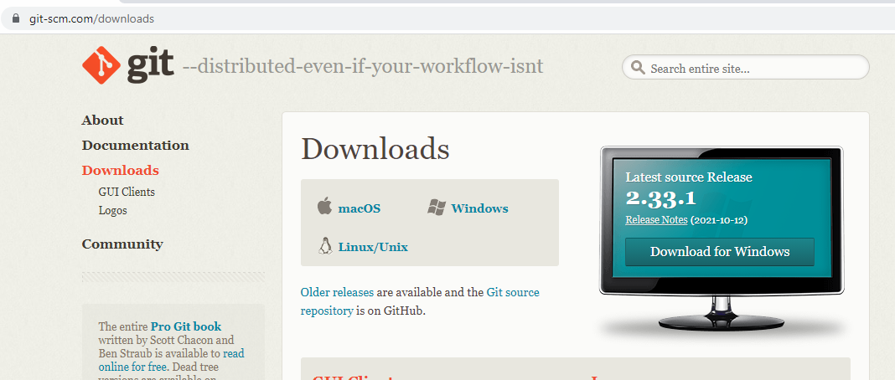
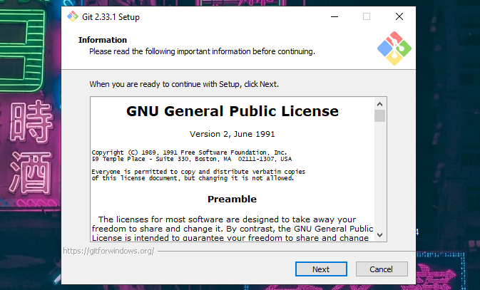
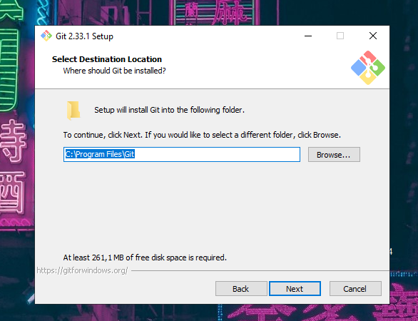
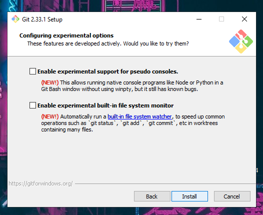
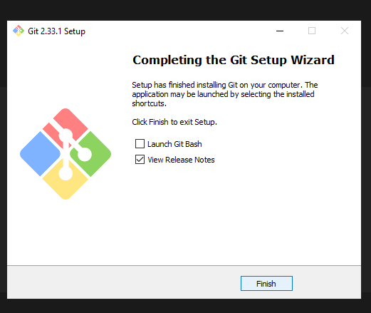
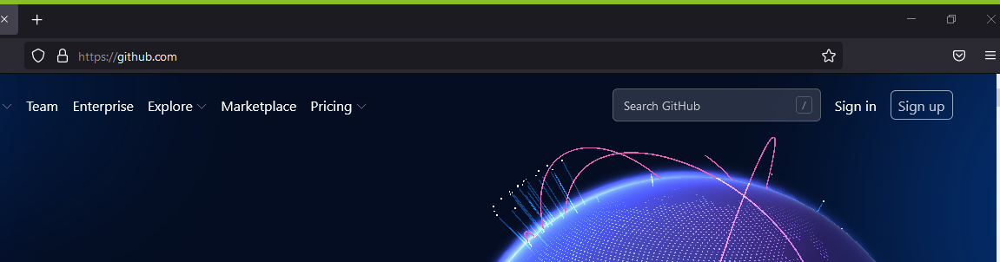
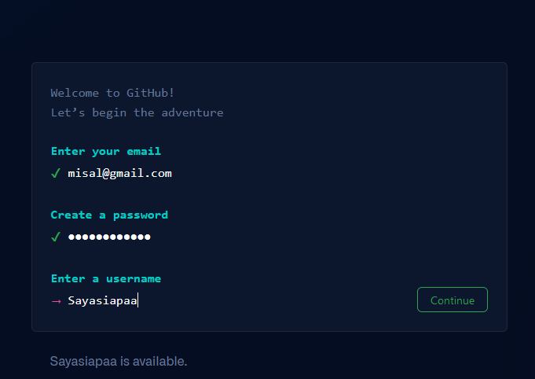
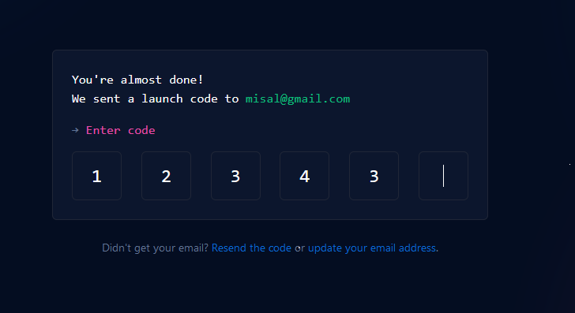
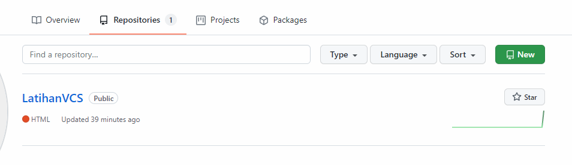
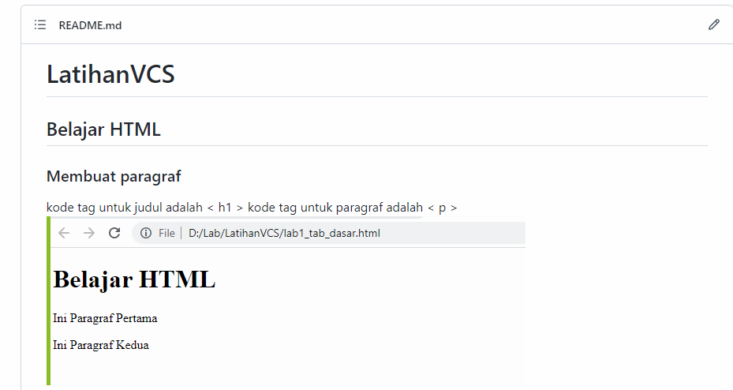

# LatihanVCS
## Tutorial penggunaan git

### Pertama Download GIT
Download git di https://git-scm.com/downloads

### Sesudah Download klik file .exe
Klik Git-2.33.1-64-bit_2.exe lalu klik next

### Tentukan Directory Git
Program files\Git                                                                                                   

### Setelah itu Klik install
Klik install                                                                                    

### Setelah Selesai
Begini Tampilanya Klik Finish                                                                                   

### Buat Akun GITHub
lalu Buat akun github klik sign up

### Masukan Email dan Password dan Tentukan username

### Lalu masukan Kode verifikasi

### Lalu copy link repository

### Pertama CD
Pertama buat file directory untuk project yang akan di buat dengan menggunakan command /d/Labs/ 

### Kedua Clone
menggunakan clone untuk mengunduh kode yang ada pada repository git clone *url github lalu gunakan cd untuk membuat file project contoh cd LatihanVCS/                                 

### Ketiga Menambahkan File
menggunakan git add untuk menambah file dan git status untuk mengecek status file

### Keempat melakukan commit
menggunakan git commit untuk menyimpan perubahan yang dilakukan, tetapi tidak ada perubahan pada remote repository "contoh git commit -m"                                                   

### Kelima melakukan push
git push untuk mengirimkan perubahan file setelah di commit ke remote repository!

### Keenam Beginilah Tampak Hasil di Github
