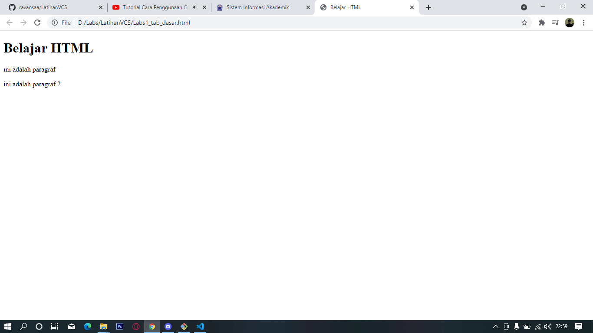
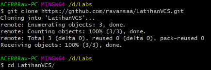
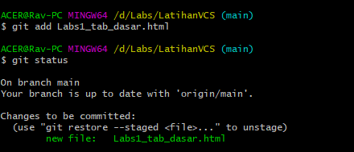

# LatihanVCS
## Tutorial penggunaan git

### Pertama CD
Pertama buat file directory untuk project yang akan di buat dengan menggunakan command /d/Labs/ 

### Kedua Clone
menggunakan clone untuk mengunduh kode yang ada pada repository git clone *url github lalu gunakan cd untuk membuat file project contoh cd LatihanVCS/                                 

### Ketiga Menambahkan File
menggunakan git add untuk menambah file dan git status untuk mengecek status file

### Keempat melakukan commit
menggunakan git commit untuk menyimpan perubahan yang dilakukan, tetapi tidak ada perubahan pada remote repository
