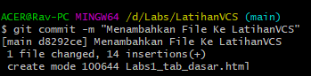
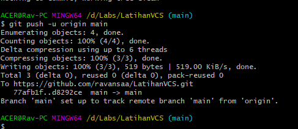

# LatihanVCS
## Belajar HTML

### Membuat paragraf
kode tag untuk judul adalah < h1 >
kode tag untuk paragraf adalah < p >

### Kedua Clone
menggunakan clone untuk mengunduh kode yang ada pada repository git clone *url github lalu gunakan cd untuk membuat file project contoh cd LatihanVCS/                                 

### Ketiga Menambahkan File
menggunakan git add untuk menambah file dan git status untuk mengecek status file

### Keempat melakukan commit
menggunakan git commit untuk menyimpan perubahan yang dilakukan, tetapi tidak ada perubahan pada remote repository "contoh git commit -m"                                                   

### Kelima melakukan push
git push untuk mengirimkan perubahan file setelah di commit ke remote repository!
